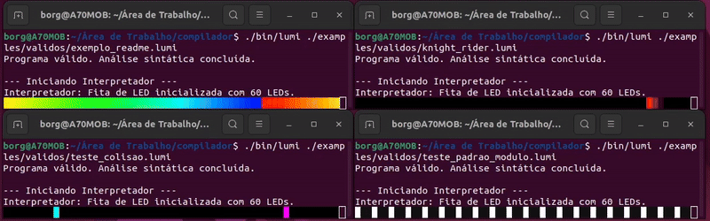

# Lumi - Uma Linguagem para Coreografia de Luzes

**Autor:** (Lucas Lima)[]

Lumi é uma linguagem de programação declarativa e de alto nível, projetada para simplificar a criação de animações complexas e coreografias de luz para fitas de LED endereçáveis. O projeto foi desenvolvido como requisito para a disciplina Lógica da Computação (Insper), englobando todas as etapas de criação de uma linguagem, desde sua especificação formal até a execução de programas em uma máquina virtual (VM) customizada.

```lumi
strip 60

for i = 0..59 {
  set i color hsv(i*4, 1, 1)
}

loop forever {
  rotate 1 dir right
  wait 50ms
}
```



## 1. Motivação e Características

O objetivo da Lumi é abstrair a complexidade da programação de microcontroladores em C++. Em vez de lidar com gerenciamento de memória, ponteiros e bibliotecas de baixo nível, o programador pode focar inteiramente na parte criativa da animação.

### Características Principais

* **Sintaxe Simples e Intuitiva**: Comandos como `set`, `rotate`, e `wait` tornam o código legível e fácil de escrever.
* **Controle Total**: Permite controle individual de cada LED da fita.
* **Estruturas de Controle Completas**: Suporta variáveis, laços `for`, laços infinitos `loop forever` e condicionais `if/else`, tornando a linguagem computacionalmente completa.
* **Cores Flexíveis**: Suporta cores no formato hexadecimal (`#FF0000`) e na função `hsv(matiz, saturação, valor)`, ideal para criar degradês e efeitos de arco-íris.
* **Simulador Integrado**: O compilador executa os programas em um simulador diretamente no terminal, usando arte ASCII colorida para uma visualização imediata, sem necessidade de hardware físico.

## 2. Como Compilar e Executar

O projeto utiliza um Makefile que automatiza todo o processo de compilação.

### Pré-requisitos

* GCC (Compilador C)
* Flex
* Bison

### Passos

Clone o repositório:

```bash
git clone https://github.com/dolthub/dolt
cd [pasta-do-projeto]
```

Compile o projeto:

```bash
make
```

Saída Esperada:

```
Compilação concluída! Executável criado em: bin/lumi
```

Execute um programa de exemplo:

```bash
./bin/lumi examples/validos/knight_rider.lumi
```

Caso você altere o projeto, limpe os arquivos da build e compile de novo:

```bash
make clean
make
```

## 3. Estrutura do Projeto

O projeto é organizado em uma estrutura de pastas clara:

```
.
├── Makefile              // O cérebro da compilação
├── README.md
├── bin/                  // Contém o executável final 'lumi'
├── build/                // Arquivos intermediários
├── doc/                  // Documentação (EBNF, imagens)
├── examples/             // Códigos de teste .lumi
└── src/                  // Código-fonte do compilador
```

### Principais Arquivos em `src/`

* `lumi.l`: Regras Flex para análise léxica.
* `lumi.y`: Gramática Bison e construção da AST.
* `ast.h`: Estruturas da AST.
* `interpreter.c`: Interpretador (VM).
* `simulator.c`: Renderização no terminal.
* `main.c`: Ponto de entrada principal.

## 4. Implementação e Cumprimento das Tarefas

### Tarefa 1: Estruturar a Linguagem em EBNF

Gramática formal definida em `doc/EBNF.txt`.

### Tarefa 2: Análise Léxica e Sintática com Flex e Bison

* **Flex (`lumi.l`)**: Expressões regulares para tokens.
* **Bison (`lumi.y`)**: Construção da AST.

### Tarefa 3: Máquina Virtual Customizada (Interpretador)

Interpretador tree-walk implementado em C (`interpreter.c`).

* Executa comandos, controla fluxo e avalia expressões.
* Inclui array para os LEDs na fita e Symbol Table para variáveis.

### Tarefa 4: Testes

Testes organizados em três categorias:

* **Exemplos Válidos**: Demonstram funcionalidades.
* **Erros Sintáticos e Léxicos**: Validação do parser.
* **Erros Semânticos**: Validação do tratamento de erros em execução.

## 5. Curiosidades e Desafios do Desenvolvimento

* **Conflito de Tokens**: Aprendizado sobre ordem de regras léxicas e reservas de palavras.
* **Evolução do Tratamento de Erros**: Melhorias na segurança e clareza dos erros.
* **Sincronização da Animação**: Integração fluida de renderização e lógica de animação através do comando `wait`.

## 6. Próximos Passos: Suporte a Hardware Real

### A Estratégia Principal: De Interpretador para Gerador de Código

A ideia é ler o arquivo `.lumi`, criar a mesma Árvore Sintática Abstrata (AST) que já é gerada atualmente, mas em vez de executá-la (interpretear), percorrer essa estrutura e escrever o código C++ equivalente em um novo arquivo (por exemplo, `efeito.ino`), que pode ser diretamente enviado para um Arduino.

### 1. Um Novo "Backend": O Gerador de Código

* **O que sai**: O arquivo `interpreter.c` e sua lógica de execução seriam desativados ou removidos.
* **O que entra**: Um novo módulo, `codegen.c`, seria criado. Sua função principal, `generate_code(ast_root)`, percorreria a AST e, em vez de alterar um array na memória, usaria `fprintf` para escrever o código C++ correspondente em um arquivo de saída `.ino`.

### 2. A "Tradução" dos Comandos

O `codegen.c` funcionaria como um tradutor. Para cada nó na AST, ele geraria o trecho de código C++ equivalente, usando bibliotecas populares como a **FastLED** ou **Adafruit NeoPixel**.

| Comando Lumi            | Código C++ (Arduino) Gerado                                |
| ----------------------- | ---------------------------------------------------------- |
| `strip 60`              | `#define NUM_LEDS 60`  <br> `CRGB leds[NUM_LEDS];`         |
| `pos = 10`              | `int pos = 10;`                                            |
| `set pos color #FF0000` | `leds[pos] = CRGB::Red;` ou `leds[pos] = CRGB(255, 0, 0);` |
| `for i = 0..59 { ... }` | `for (int i = 0; i <= 59; i++) { ... }`                    |
| `if (pos > 10) { ... }` | `if (pos > 10) { ... }`                                    |
| `wait 40ms`             | `FastLED.show();` <br> `delay(40);`                        |

#### A Mudança Mais Importante:

O comando `wait` se torna o ponto central da execução. No simulador, ele desenha no terminal. No código C++, ele seria traduzido como `FastLED.show()` seguido de `delay()`, enviando os dados para a fita de LED real.

### 3. Mudança na Estrutura do Projeto

A estrutura geral do projeto se manteria quase inalterada. A principal diferença estaria na saída do programa:

* **Entrada**: `meu_efeito.lumi`
* **Execução**: `./bin/lumi ./examples/validos/meu_efeito.lumi`
* **Saída**: Um novo arquivo `meu_efeito.ino`, pronto para ser aberto na IDE do Arduino e enviado para a placa
